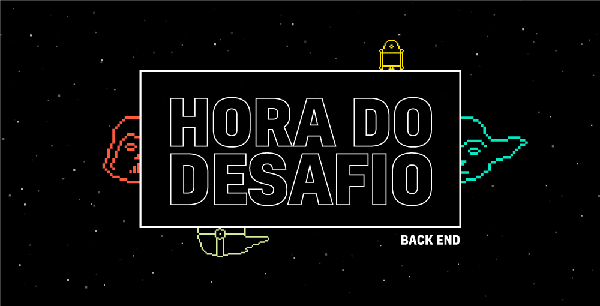

<div align="center" style="margin-top: 1em">
  
  <h1> B2W Challenge - Star Wars </h1>
</div>

## Contents

- [About](#about)
- [Technologies](#technologies)
- [Running](#running)
  - [Environment Variables](#environment-variables)
  - [Running from source](#running-from-source)
  - [Running with Docker](#running-with-docker)
- [Tests](#tests)
  - [Integration Tests](#integration-tests)
  - [Unit Tests](#unit-tests)
- [The API](#the-api)
  - [Avaliable Endpoints](#avaliable-endpoints)
    - [```POST /planets```](#post-planets)
    - [```GET /planets```](#get-planets)
    - [```GET /planets/:id```](#get-planetsid)
    - [```GET /planets?name=:name```](#get-planetsnamename)
    - [```DELETE /planets/:id```](#delete-planetsid)
- [License](#license)

# About

This project is a simple REST API created during the selection process for a position on B2W Digital. It provides information about planets from the Star Wars movies. It interacts with SWAPI ([https://swapi.dev/](https://swapi.dev/)), a public API with data from the franchise.

# Technologies

- [Golang 1.14](https://golang.org)
- [MongoDB 4.2](https://www.mongodb.com/)
- [Docker 19.03.11](https://www.docker.com/)
- [Docker Compose 1.24.0-rc1](https://docs.docker.com/compose/)

# Running

The project can be run by compiling the source code and/or using Docker.

## Environment Variables
| Name                       | Default                    | Description                                       |
| -------------------------- | -------------------------- | ------------------------------------------------- |
| API_PORT                   | 9080                       | Port used by the API                              |
| SWAPI_URL                  | https://swapi.dev/api      | Base url for the SWAPI api.                       |
| MONGODB_URI                | mongodb://localhost:27017/ | URI to your MongoDB server                        |
| MONGODB_DATABASE_NAME      | starwars                   | Database name to be used by the API               |
| MONGODB_TEST_DATABASE_NAME | starwars_testdb            | Database name to be used by the integration tests |

## Running from source

To compile the code from this repository, you'll need to install [Golang](https://golang.org/doc/install) and [MongoDB](https://docs.mongodb.com/manual/installation/) on your machine. 

After setting up your MongoDB server, we can compile and run the api. **For simplicity, authentication is not used when connecting to the MongoDB server. Make sure you setup your server accordingly**

At the root folder of this repository, run the command:

 ```go build -o starwars_api . ```

The ```-o``` flag sets the name of the output binary.

Now simply run the resulting binary: 

```./starwars_api```

The api will be avaliable at: http://localhost:9080/api/

To modify the starting parameters such as port and database uri, add the environment variables from the table above before the binary in the run command:

```MONGODB_URI='mongodb://localhost:27017/' API_PORT='9500' ./starwars_api```

## Running with Docker

Install [Docker](https://docs.docker.com/get-docker/) and [Docker Compose](https://docs.docker.com/compose/). 

At the root folder of this repository, run the command:

```docker-compose up --build -d``` 

To stop and remove the containers, run ```docker-compose down``` .

To modify environment variables, edit the ```docker-compose.yaml``` file.

The api will be avaliable at: http://localhost:9080/api/

# Tests

Tests can be run from source and with Docker. In order to run tests on Docker, the containers (api and db) must be running.

## Integration Tests

Integration tests require an internet connection and the MongoDB instance to be running.

**From source**

```go test desafio-b2w/tests -tags=integration -v```

**Docker**

```docker-compose exec starwars_api go test desafio-b2w/tests -tags=integration -v```

```starwars_api``` is the container name created on the previous step.


## Unit Tests

**From source**

```go test desafio-b2w/tests -tags=unit -v```

**Docker**

```docker-compose exec starwars_api go test desafio-b2w/tests -tags=unit -v```

# The API

The base url for the api is ```/api```. Both requests and responses use ```Content-type: application/json```.

## Avaliable Endpoints

### ```POST /planets```

**Request Body**

| Property | Type   | Info                     |
| -------- | ------ | ------------------------ |
| name     | string | required, must be unique |
| terrain  | string | required                 |
| climate  | string | required                 |

**Response**

Status 201
```
{
    "id": "5ed6d8fdfa09e89371ded229",
    "name": "Tatooine",
    "climate": "Arid",
    "terrain": "Mountain",
    "filmAppearances": 5
}
```

Status 400 (either if the name already exists or a required property is empty). 

Ex:
```
{
  "Status": 400,
  "Code": "planet.duplicated",
  "Message": "A planet with the given name already exists."
}

```


### ```GET /planets```

**Response**

Status 200
```
[
  {
    "id": "5ed6d8fdfa09e89371ded229",
    "name": "Tatooine",
    "climate": "Arid",
    "terrain": "Desert",
    "filmAppearances": 5
  },
  {
    "id": "5ed6da0bfa09e89371ded22a",
    "name": "Yavin IV",
    "climate": "Temperate, tropical",
    "terrain": "Jungle, rainforests",
    "filmAppearances": 1
  }
]
```

### ```GET /planets/:id```

**Response**

Status 200

```
  {
    "id": "5ed6da0bfa09e89371ded22a",
    "name": "Yavin IV",
    "climate": "Temperate, tropical",
    "terrain": "Jungle, rainforests",
    "filmAppearances": 1
  }
```

Status 400

```
  {
    "Status": 400,
    "Code": "invalid.id",
    "Message": "The given ID is invalid."
  }

```

Status 404

```
  {
    "Status": 404,
    "Code": "not_found",
    "Message": "The requested resource was not found."
  }

```

### ```GET /planets?name=:name```

Status 200

```
  {
    "id": "5ed6d8fdfa09e89371ded229",
    "name": "Tatooine",
    "climate": "Arid",
    "terrain": "Desert",
    "filmAppearances": 5
  }
```

Status 404

```
  {
    "Status": 404,
    "Code": "not_found",
    "Message": "The requested resource was not found."
  }

```

### ```DELETE /planets/:id```

Status 200

```Empty body```

Status 400

```
  {
    "Status": 400,
    "Code": "invalid.id",
    "Message": "The given ID is invalid."
  }

```

Status 404

```
  {
    "Status": 404,
    "Code": "not_found",
    "Message": "The requested resource was not found."
  }

```

# License

This project is under the [MIT](https://github.com/dubonzi/desafio-b2w/blob/master/LICENSE) license.